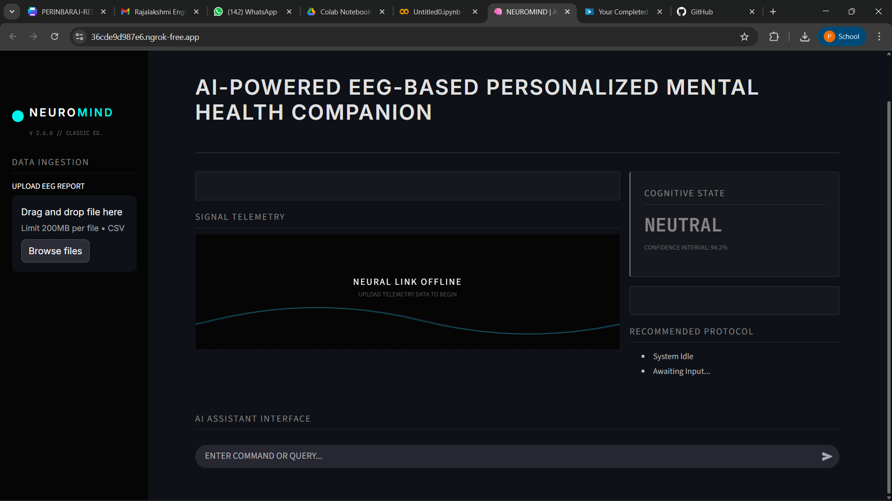
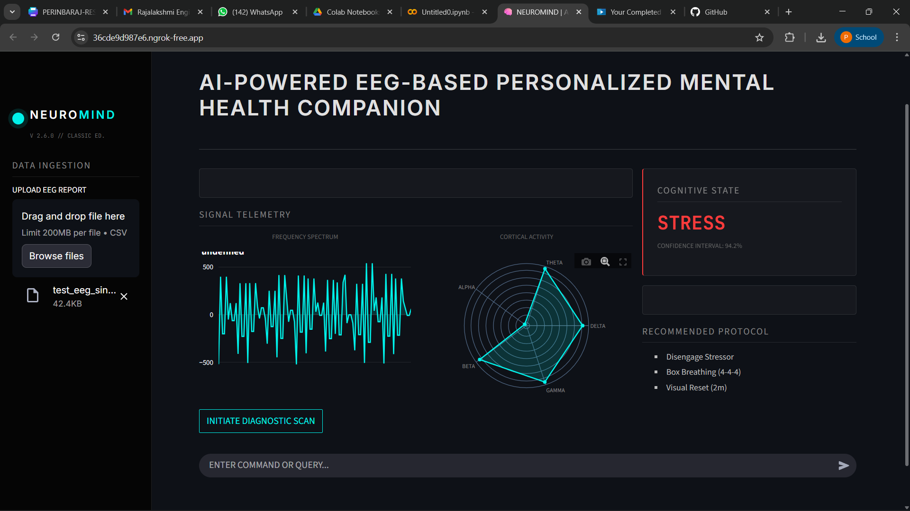
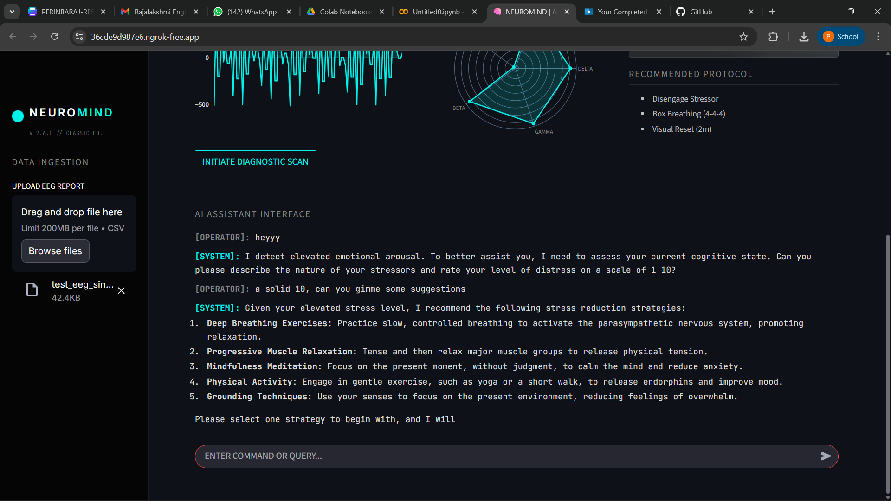

# NeuroMind
This system uses EEG brainwave data and AI to monitor your mental state in real time. It provides personalized insights and support to improve mental wellness.
# Overview
This project presents an AI-powered EEG-based personalized mental health companion that processes raw brainwave signals to understand a user’s emotional and cognitive state. The system begins with EEG data cleaning, filtering, encoding, and dimensionality reduction, followed by extracting key statistical and frequency-band features. A hybrid model framework integrates deep learning models (CNN, LSTM) with machine learning models (SVM, Random Forest, XGBoost) to achieve accurate mental-state classification. Through the evaluation module, performance is validated using accuracy, precision, recall, F1-score, confusion matrices, and learning curves. A Streamlit web interface enables users to upload EEG data, view real-time predictions, and visualize results through an intuitive dashboard. Finally, the prediction engine provides personalized mental-state insights—such as detecting calmness or stress—while the AI assistant offers supportive interactions, making the system a smart, user-friendly mental health companion.
# architecture

# UI Preview

